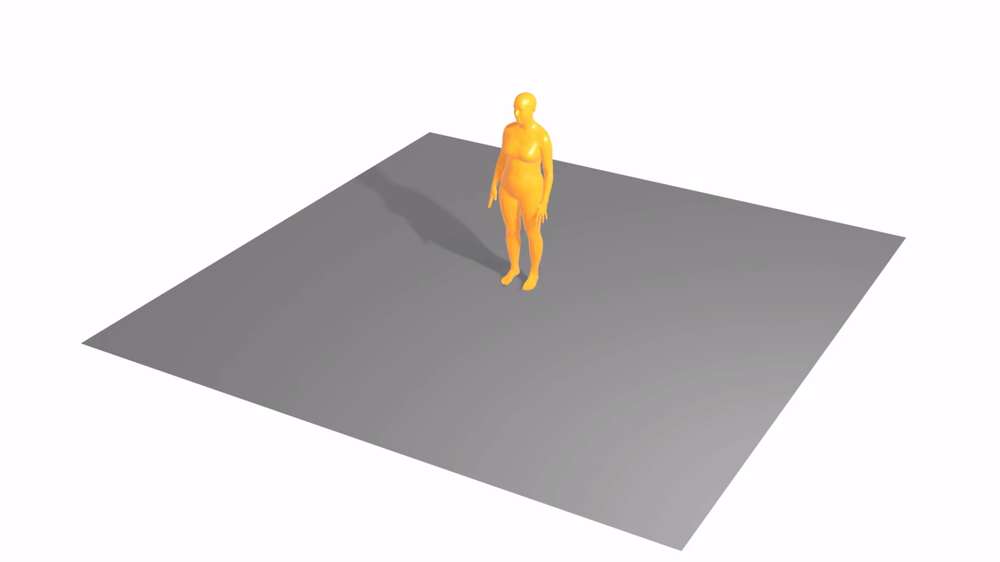
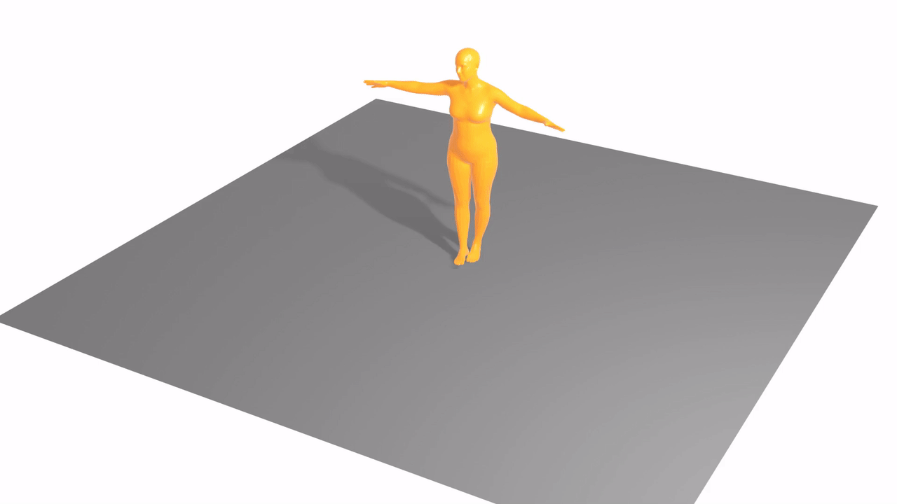
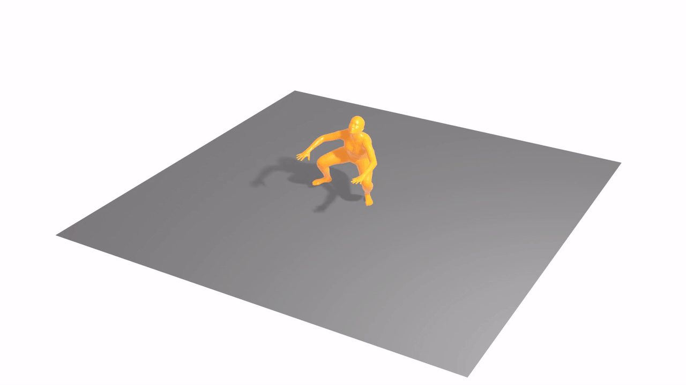

# KeyMotion: Text-guided 3D Human Motion Generation with Keyframe-based Parallel Skip Transformer

## Timeline

- [x] Demo
- [ ] Model release - coming soon
- [ ] Pretrained model release - coming soon

## Demo

### I. Text-to-Motion

<table style="width: 100%; text-align: center;">
  <tr>
    <td style="vertical-align: top;">
      
      
A person walks around in a circle.

    </td>
    <td style="vertical-align: top;">
      
      
The sim extends arms outward, then takes a seat in a cross-legged fashion before standing up again.

    </td>
    <td style="vertical-align: top;">
      
      
The figure bends down, gets on their hands and knees, and begins crawling to the left.

    </td>
  </tr>
  <tr>
    <td style="vertical-align: top;">
      
      
A man slowly moves forward while squatting.

    </td>
    <td style="vertical-align: top;">
      
      
The person is walking upstairs.

    </td>
    <td style="vertical-align: top;">
      
      
A person raises both arms to shoulder height then does multiple squats.

    </td>
  </tr>
</table>

### II. Bone length Constraints.

